# Comprehensive Architectural Guide: 32-Bit Single-Cycle RISC-V CPU

This guide provides an end-to-end breakdown of the 32-bit Single-Cycle RISC-V CPU implemented in `E:\verilogCBP\rtl`. It includes structural mindmaps, datapath diagrams, per-module input/output interface schematics, internal logic explanations, and an instruction execution trace.

---

## 1. System Overview & Architecture Mindmap

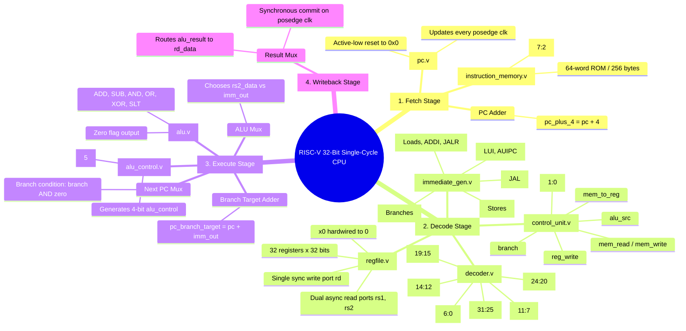

---

## 2. Top-Level Datapath Interconnection

The complete single-cycle datapath connects the 8 internal submodules as shown below:

```mermaid
graph LR
    subgraph FETCH ["Fetch Stage"]
        PC["pc.v<br/>(Program Counter)"] -->|pc_current| IMEM["instruction_memory.v<br/>(ROM)"]
        PC -->|pc_current| PCADD["Adder: PC + 4"]
        PCADD -->|pc_plus_4| PCMUX{"Next PC Mux"}
        PCMUX -->|pc_next| PC
    end

    subgraph DECODE ["Decode & Register Stage"]
        IMEM -->|instruction| DEC["decoder.v"]
        IMEM -->|instruction| IMMGEN["immediate_gen.v"]
        
        DEC -->|opcode[6:0]| CTRL["control_unit.v"]
        DEC -->|rs1[4:0]| RF["regfile.v"]
        DEC -->|rs2[4:0]| RF
        DEC -->|rd[4:0]| RF

        CTRL -->|reg_write| RF
        CTRL -->|alu_src| ALUMUX{"ALU Mux"}
        CTRL -->|alu_op[1:0]| ALUCTRL["alu_control.v"]
        CTRL -->|branch| BR_AND{"AND Gate"}

        DEC -->|funct3[2:0]| ALUCTRL
        DEC -->|funct7[5]| ALUCTRL
    end

    subgraph EXECUTE ["Execution Stage"]
        RF -->|rs1_data| ALU["alu.v"]
        RF -->|rs2_data| ALUMUX
        IMMGEN -->|imm_out| ALUMUX
        ALUMUX -->|alu_b_operand| ALU
        ALUCTRL -->|alu_control[3:0]| ALU

        IMMGEN -->|imm_out| BRADD["Adder: PC + Imm"]
        PC -->|pc_current| BRADD
        BRADD -->|pc_branch_target| PCMUX

        ALU -->|zero| BR_AND
        BR_AND -->|branch & zero| PCMUX
    end

    subgraph WRITEBACK ["Writeback Stage"]
        ALU -->|alu_result| RF
    end
```

---

## 3. Module-by-Module Breakdown

```mermaid
graph TD
    classDef mod fill:#2b3a42,stroke:#4f9da6,stroke-width:2px,color:#ffffff;
    classDef inPort fill:#1b4965,stroke:#62b6cb,stroke-width:1px,color:#ffffff;
    classDef outPort fill:#2c6e49,stroke:#90be6d,stroke-width:1px,color:#ffffff;
```

---

### Module 1: Program Counter (`pc.v`)

#### Interface Diagram
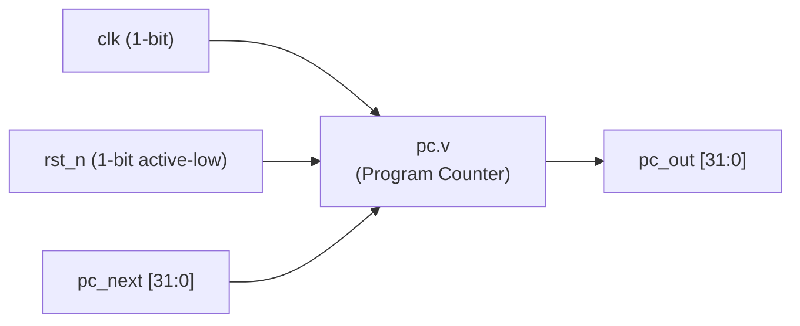

#### Port Definitions
| Port | Direction | Width | Connected To | Description |
| :--- | :---: | :---: | :--- | :--- |
| `clk` | Input | 1 | Global Clock | Triggers state update on rising edge. |
| `rst_n` | Input | 1 | Global Reset | Active-low asynchronous reset. Resets PC to `0x00000000`. |
| `pc_next` | Input | 32 | Next PC Mux | Next instruction byte address (`pc + 4` or branch target). |
| `pc_out` | Output | 32 | IMEM, Adders | Current instruction memory address. |

#### Internal Logic
- **Flip-Flop Behavior**: Evaluates on `@(posedge clk or negedge rst_n)`.
- When `rst_n == 0`, `pc_out <= 32'h00000000`.
- Otherwise on clock tick, `pc_out <= pc_next`.

---

### Module 2: Instruction Memory (`instruction_memory.v`)

#### Interface Diagram
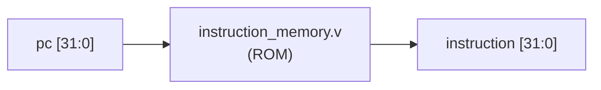

#### Port Definitions
| Port | Direction | Width | Connected To | Description |
| :--- | :---: | :---: | :--- | :--- |
| `pc` | Input | 32 | `pc.v` (`pc_out`) | Byte-aligned program counter. |
| `instruction` | Output | 32 | `decoder`, `immediate_gen` | Fetched 32-bit machine code instruction. |

#### Internal Logic & Design Considerations
- **Word-Aligned Addressing**: RISC-V instructions are 4 bytes (32 bits) wide. Therefore, the lowest 2 bits of `pc` (`pc[1:0]`) are always `2'b00`.
- The memory array is indexed by `pc[7:2]` (`pc >> 2`), selecting one of the 64 words (256-byte ROM space).
- Asynchronous combinational read: `assign instruction = memory[pc[7:2]];`. As soon as `pc` settles, the instruction is immediately available.

---

### Module 3: Instruction Decoder (`decoder.v`)

#### Interface Diagram
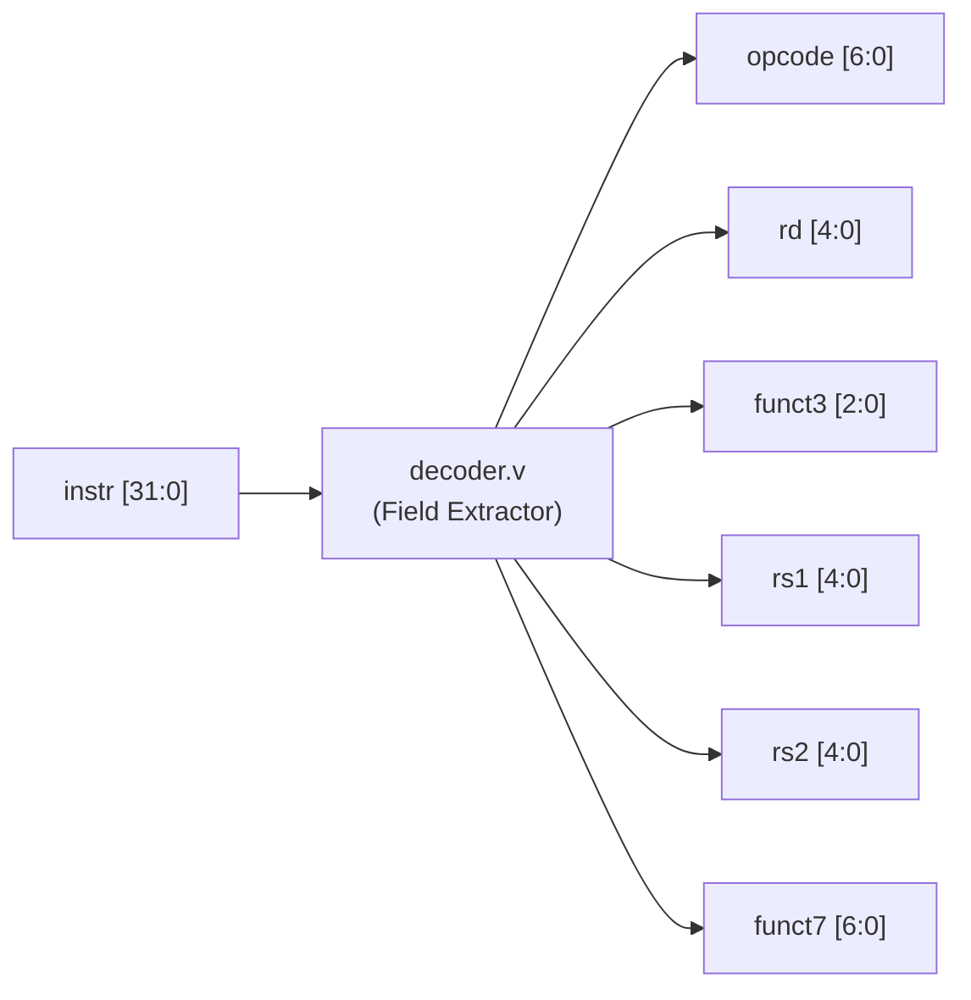

#### Port Definitions
| Port | Direction | Width | Connected To | Description |
| :--- | :---: | :---: | :--- | :--- |
| `instr` | Input | 32 | `instruction_memory` | 32-bit instruction code. |
| `opcode` | Output | 7 | `control_unit` | Instruction opcode (`instr[6:0]`). |
| `rd` | Output | 5 | `regfile.rd_addr` | Destination register address (`instr[11:7]`). |
| `funct3` | Output | 3 | `alu_control` | 3-bit sub-function code (`instr[14:12]`). |
| `rs1` | Output | 5 | `regfile.rs1_addr` | Source register 1 address (`instr[19:15]`). |
| `rs2` | Output | 5 | `regfile.rs2_addr` | Source register 2 address (`instr[24:20]`). |
| `funct7` | Output | 7 | `alu_control` | 7-bit function code (`instr[31:25]`). |

#### Internal Logic
Pure combinational direct bit extraction:
```verilog
assign opcode = instr[6:0];
assign rd     = instr[11:7];
assign funct3 = instr[14:12];
assign rs1    = instr[19:15];
assign rs2    = instr[24:20];
assign funct7 = instr[31:25];
```

---

### Module 4: Main Control Unit (`control_unit.v`)

#### Interface Diagram
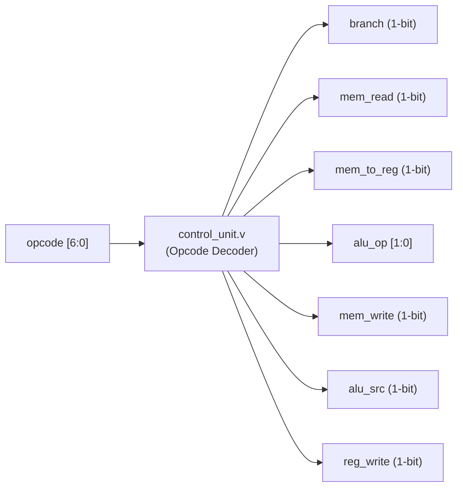

#### Control Signals Truth Table
| Instruction Type | `opcode` | `reg_write` | `alu_src` | `alu_op` | `branch` | `mem_read` | `mem_write` | `mem_to_reg` |
| :--- | :---: | :---: | :---: | :---: | :---: | :---: | :---: | :---: |
| **R-Type** (`add`, `sub`, etc.) | `0110011` | 1 | 0 | `2'b10` | 0 | 0 | 0 | 0 |
| **I-Type ALU** (`addi`, etc.) | `0010011` | 1 | 1 | `2'b11` | 0 | 0 | 0 | 0 |
| **Load** (`lw`) | `0000011` | 1 | 1 | `2'b00` | 0 | 1 | 0 | 1 |
| **Store** (`sw`) | `0100011` | 0 | 1 | `2'b00` | 0 | 0 | 1 | X |
| **Branch** (`beq`) | `1100011` | 0 | 0 | `2'b01` | 1 | 0 | 0 | X |

#### Key Logic Separation
- `alu_op = 2'b10` is reserved specifically for **R-type** instructions where `funct7[5]` distinguishes `ADD` from `SUB`.
- `alu_op = 2'b11` is dedicated to **I-type arithmetic** instructions (`ADDI`, etc.) where subtraction does not exist, ensuring negative immediate values never accidentally trigger a `SUB`.

---

### Module 5: Immediate Generator (`immediate_gen.v`)

#### Interface Diagram
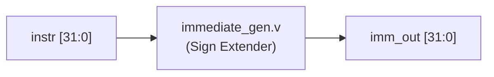

#### Immediate Formats Supported
```
I-Type:  [31 ---------------- 20] -> Sign-extended to 32 bits
S-Type:  [31 --- 25] [11 -- 7]   -> Sign-extended to 32 bits
B-Type:  [31] [7] [30:25] [11:8] '0' -> Sign-extended branch offset
U-Type:  [31 ---------------- 12] 12'b0 -> Upper 20 bits
J-Type:  [31] [19:12] [20] [30:21] '0' -> Sign-extended jump offset
```

#### Bit Reconstruction Formulas
| Format | Opcode | Immediate Extraction Formula |
| :--- | :--- | :--- |
| **I-Type** | `0010011`, `0000011`, `1100111` | `{{20{instr[31]}}, instr[31:20]}` |
| **S-Type** | `0100011` | `{{20{instr[31]}}, instr[31:25], instr[11:7]}` |
| **B-Type** | `1100011` | `{{19{instr[31]}}, instr[31], instr[7], instr[30:25], instr[11:8], 1'b0}` |
| **U-Type** | `0110111`, `0010111` | `{instr[31:12], 12'b0}` |
| **J-Type** | `1101111` | `{{11{instr[31]}}, instr[31], instr[19:12], instr[20], instr[30:21], 1'b0}` |

---

### Module 6: Register File (`regfile.v`)

#### Interface Diagram
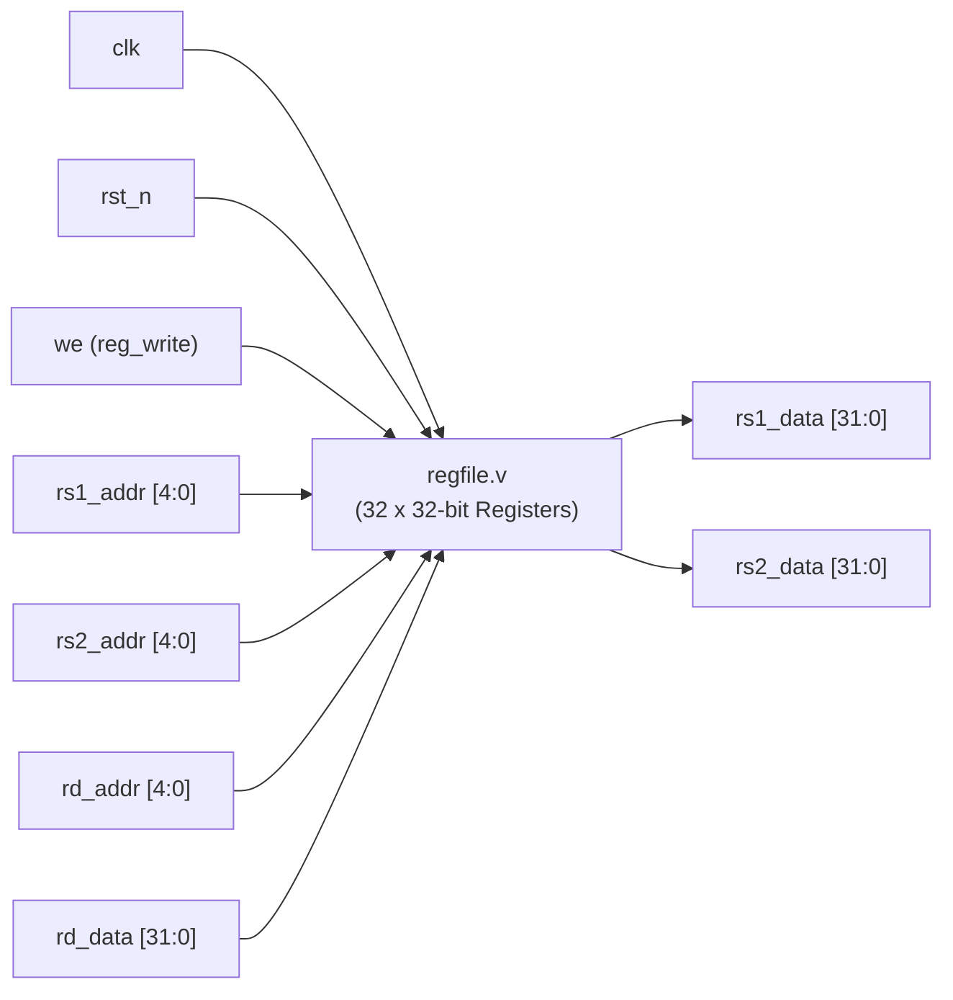

#### Port Definitions
| Port | Direction | Width | Connected To | Description |
| :--- | :---: | :---: | :--- | :--- |
| `clk` | Input | 1 | Global Clock | Synchronous write trigger. |
| `rst_n` | Input | 1 | Global Reset | Active-low reset (clears registers to 0). |
| `we` | Input | 1 | `control_unit.reg_write` | Write enable signal. |
| `rs1_addr` | Input | 5 | `decoder.rs1` | Read address port 1 ($x0 - x31$). |
| `rs2_addr` | Input | 5 | `decoder.rs2` | Read address port 2 ($x0 - x31$). |
| `rd_addr` | Input | 5 | `decoder.rd` | Write address port ($x0 - x31$). |
| `rd_data` | Input | 32 | Datapath Writeback | Data to commit into `rd_addr`. |
| `rs1_data` | Output | 32 | `alu.a` | Asynchronous read data for `rs1`. |
| `rs2_data` | Output | 32 | `alu_src` Mux | Asynchronous read data for `rs2`. |

#### Essential Architecture Rules
1. **$x0$ Hardwired Zero**:
   - `assign rs1_data = (rs1_addr == 5'd0) ? 32'd0 : rf[rs1_addr];`
   - `assign rs2_data = (rs2_addr == 5'd0) ? 32'd0 : rf[rs2_addr];`
   - Writes to $x0$ are explicitly suppressed: `if (we && (rd_addr != 5'd0))`.
2. **Dual Asynchronous Read**: Reads occur combinationally during the decode cycle without waiting for a clock edge.
3. **Synchronous Write**: Register writes commit on `posedge clk`.

---

### Module 7: ALU Control Unit (`alu_control.v`)

#### Interface Diagram
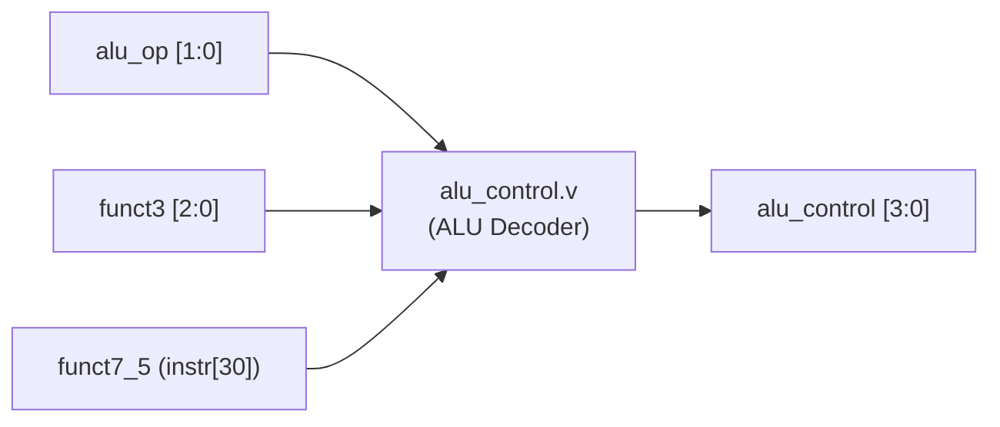

#### Operation Truth Table
| `alu_op` | Instruction Class | `funct3` | `funct7[5]` | Output `alu_control` | Operation |
| :---: | :--- | :---: | :---: | :---: | :--- |
| `2'b00` | Loads & Stores | `XXX` | `X` | `4'b0000` | ADD |
| `2'b01` | Branches (`beq`) | `XXX` | `X` | `4'b0001` | SUB |
| `2'b10` | R-Type (`add`/`sub`) | `3'b000` | `1'b0` | `4'b0000` | ADD |
| `2'b10` | R-Type (`sub`) | `3'b000` | `1'b1` | `4'b0001` | SUB |
| `2'b10` | R-Type (`or`) | `3'b110` | `X` | `4'b0011` | OR |
| `2'b10` | R-Type (`and`) | `3'b111` | `X` | `4'b0010` | AND |
| `2'b10` | R-Type (`xor`) | `3'b100` | `X` | `4'b0100` | XOR |
| `2'b10` | R-Type (`slt`) | `3'b010` | `X` | `4'b0101` | SLT |
| `2'b11` | I-Type (`addi`) | `3'b000` | `X` | `4'b0000` | ADD |
| `2'b11` | I-Type (`ori`) | `3'b110` | `X` | `4'b0011` | OR |
| `2'b11` | I-Type (`andi`) | `3'b111` | `X` | `4'b0010` | AND |
| `2'b11` | I-Type (`xori`) | `3'b100` | `X` | `4'b0100` | XOR |
| `2'b11` | I-Type (`slti`) | `3'b010` | `X` | `4'b0101` | SLT |

---

### Module 8: Arithmetic Logic Unit (`alu.v`)

#### Interface Diagram
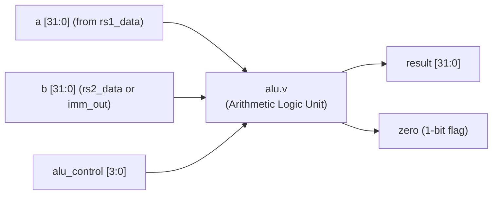

#### Operation Encoding
| `alu_control` | Constant | Operation | Verilog Implementation |
| :---: | :--- | :--- | :--- |
| `4'b0000` | `ALU_ADD` | Addition | `result = a + b;` |
| `4'b0001` | `ALU_SUB` | Subtraction | `result = a - b;` |
| `4'b0010` | `ALU_AND` | Bitwise AND | `result = a & b;` |
| `4'b0011` | `ALU_OR` | Bitwise OR | `result = a \| b;` |
| `4'b0100` | `ALU_XOR` | Bitwise XOR | `result = a ^ b;` |
| `4'b0101` | `ALU_SLT` | Set Less Than (signed) | `result = ($signed(a) < $signed(b)) ? 32'd1 : 32'd0;` |

#### Zero Flag Generation
```verilog
assign zero = (result == 32'h00000000);
```
Used in conditional branching: if `a == b` during a branch instruction (`SUB`), `result == 0`, asserting `zero = 1`. Combined with `branch == 1`, this enables the branch target mux.

---

### Module 9: Top-Level Integration (`cpu.v`)

#### Interface Diagram
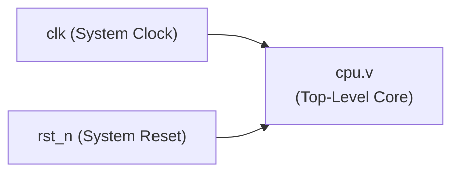

#### Datapath Muxes
1. **ALU Operand B Mux**:
   - `assign alu_b_operand = alu_src ? imm_out : rs2_data;`
   - Selects immediate value for I-type/Loads/Stores, or register value for R-type/Branches.
2. **Next PC Mux**:
   - `assign pc_next = (branch & zero) ? pc_branch_target : pc_plus_4;`
   - Selects `PC + 4` sequentially or jumps to `PC + imm_out` on taken branch.
3. **Writeback Data**:
   - `assign writeback_data = alu_result;` (connects ALU computation to `regfile.rd_data`).

---

## 4. End-to-End Single-Cycle Execution Trace

The preloaded test program in `instruction_memory.v` executes as follows across 7 clock cycles:

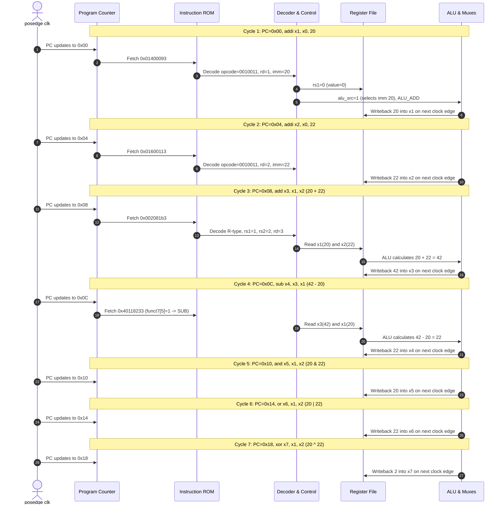

---

## 5. Verification Commands & Waveforms

You can re-run any simulation directly from PowerShell:

```powershell
# 1. Ensure PATH has the Icarus Verilog binary
$env:Path = "E:\iverilog\app\bin;E:\iverilog\app\gtkwave\bin;" + $env:Path

# 2. Run ALU standalone testbench
iverilog -o alu_sim.vvp E:\verilogCBP\rtl\alu.v E:\verilogCBP\testbenches\alu_milestone1tb.v
vvp alu_sim.vvp

# 3. Run Register File + ALU integration testbench
iverilog -o ms2_sim.vvp E:\verilogCBP\rtl\alu.v E:\verilogCBP\rtl\regfile.v E:\verilogCBP\testbenches\tb_milestone2.v
vvp ms2_sim.vvp

# 4. Run Full Single-Cycle CPU testbench
iverilog -o sim_cpu.vvp (Get-ChildItem E:\verilogCBP\rtl\*.v).FullName E:\verilogCBP\testbenches\tb_cpu.v
vvp sim_cpu.vvp

# 5. Open waveform in GTKWave
gtkwave cpu_trace.vcd
```
